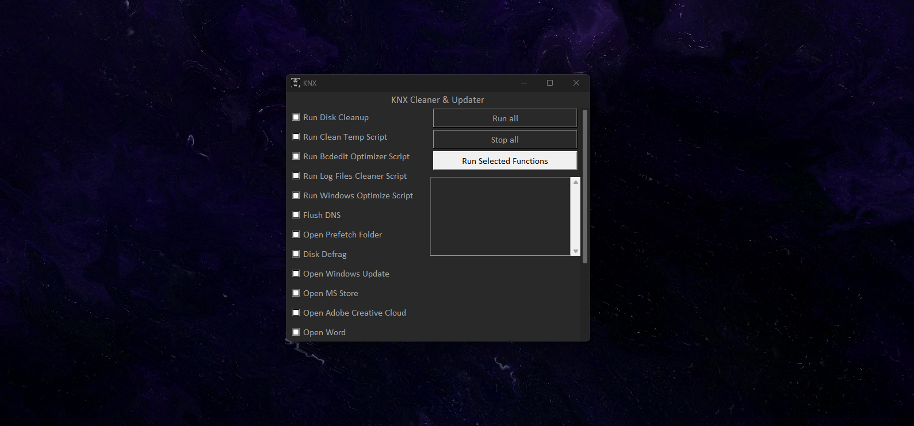

# KNX Cleaner & Updater 🧹🔄

KNX Cleaner & Updater is a Python application designed to automate various system maintenance tasks on Windows systems. It provides a user-friendly interface for running common maintenance functions such as disk cleanup, defragmentation, software updates, and more.

## Features ✨

- **User-friendly Interface:** The application provides an intuitive graphical user interface (GUI) for easy navigation and operation.
- **Multiple Maintenance Functions:** KNX Cleaner & Updater offers a range of system maintenance functions, including disk cleanup, prefetch management, Windows updates, application optimizations, and more.
- **Run All or Individual Functions:** Users can choose to run all available functions simultaneously or select specific functions to execute.
- **Output Logging:** Output messages from each function execution are displayed in the application's output window, providing real-time feedback to the user.
- **Stop All Functions:** Users have the option to stop all running functions with a single click, ensuring control and flexibility during maintenance tasks.
- **Alert Window:** The application includes an alert window feature to notify users of important events or errors during function execution.

## Installation 🚀

1. Clone this repository to your local machine.
2. Install Python 3 if you haven't already.
3. Install the required dependencies by running `pip install -r requirements.txt`.
4. Run the application by executing `python main.py`.

## Usage 🛠️

- Click on the buttons to run individual functions.
- Click "Run all" to execute all functions sequentially.
- Click "Stop all" to stop all running functions.
- The application will log the progress and errors of each function in the output text area.

## Dependencies 📦

- Python 3.x
- `tkinter` (included in standard library)
- `customtkinter`
- `pygetwindow`
- `ctypes`
- `os`
- ...

## Contributing 🤝

Contributions are welcome! If you have any ideas for new features, improvements, or bug fixes, feel free to open an issue or submit a pull request.

## License 📄

This project is licensed under the MIT License - see the [LICENSE](LICENSE) file for details.
